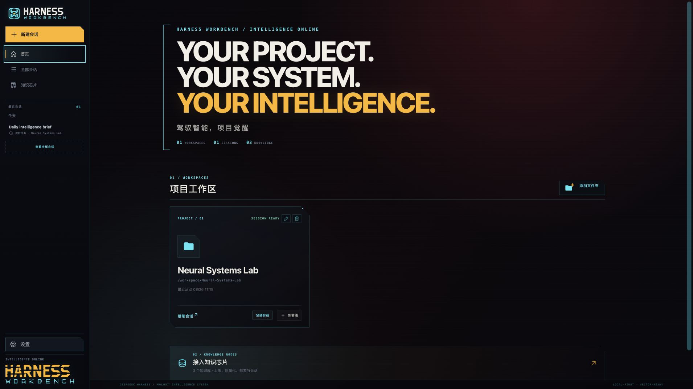
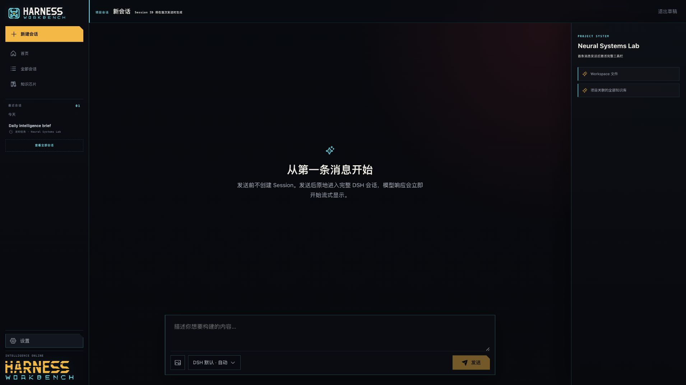
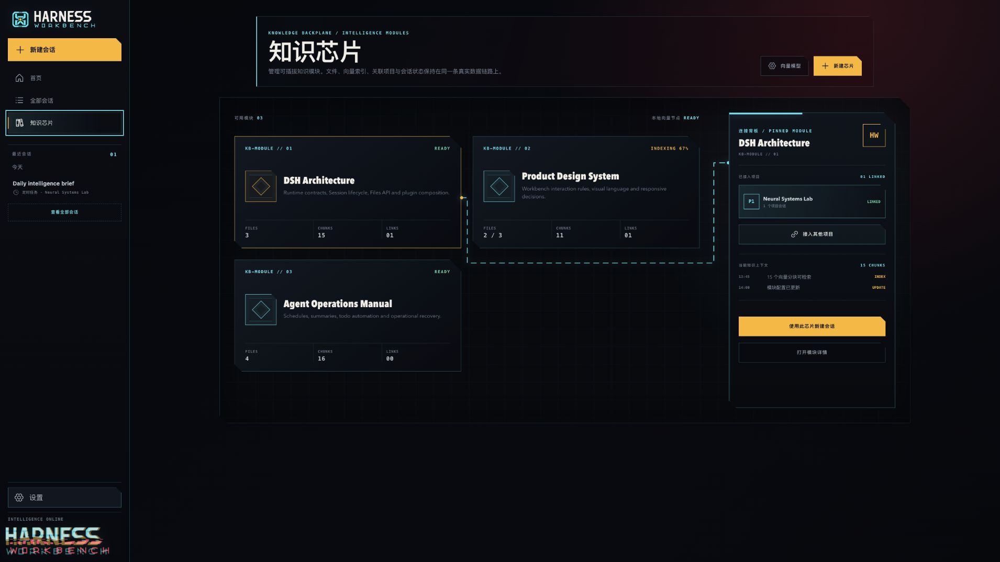
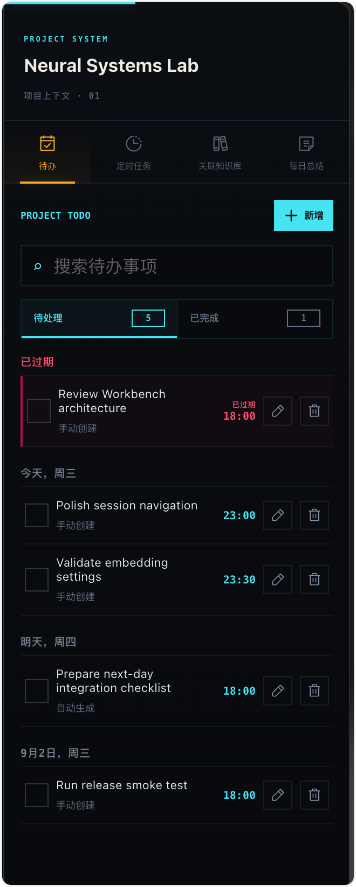
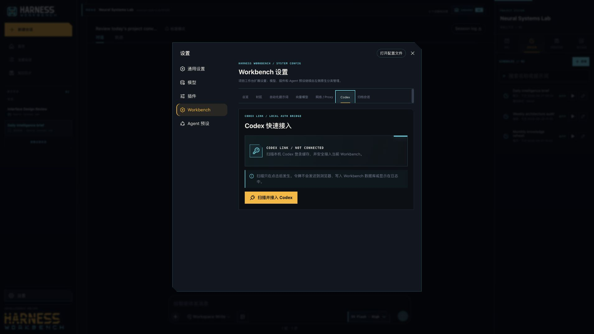

# Harness Workbench

<p align="center">
  
</p>

<p align="center">
  <strong>YOUR PROJECT. YOUR SYSTEM. YOUR INTELLIGENCE.</strong><br>
  A local-first personal intelligence workbench for projects, sessions, knowledge chips, and automation.
</p>

<p align="center">
  <strong>English</strong> · <a href="./README.zh-CN.md">简体中文</a>
</p>

<p align="center">
  DeepSeek Harness 0.1.1-rc.2 · Node.js 22.5+ · Local-first RAG · MIT License
</p>

> [!IMPORTANT]
> This release targets the public Session, Files, Subagent, and Slot APIs in **DeepSeek Harness 0.1.1-rc.2**. DSH is still a release candidate; validate compatibility before upgrading it independently.

Harness Workbench does not replace the DeepSeek Harness chat runtime. DSH sessions remain the source of truth. Workbench adds project organization, knowledge chips, local RAG, todos, scheduled agents, daily summaries, and optional Codex authentication around that runtime—turning isolated AI chats into a durable personal work system.

```bash
npm install -g dsh-cyberpunk-workbench
dsh-workbench
```

## Interface tour

### A project-centered workbench



### Native DSH sessions with project context



### Knowledge-chip backplane



### Todos and scheduled agents



### Workbench settings and Codex bridge



## Why Harness Workbench exists

An AI session is good at solving the problem in front of it. Real work spans days, multiple conversations, folders, documents, and recurring responsibilities. Workbench handles the layer outside a single prompt:

- Which sessions belong to a project, and what did each one accomplish?
- Which documents and knowledge sources support that project, and are they indexed?
- What was completed today, and what should happen next?
- Can a scheduled task launch a real agent and preserve its execution as a traceable session?
- Can DSH keep owning models, tools, trajectories, Files, and subagents instead of being reimplemented incompletely?

The core rule is simple: **containers organize context; DSH sessions do the work.**

## One session model, three scopes

Project sessions, knowledge-chip sessions, and independent sessions are all full DSH sessions. Their scope determines what context and project tools they inherit.

| Scope | Best for | Inherited context | Scope-specific tools |
| --- | --- | --- | --- |
| **Project** | Ongoing work inside one workspace | Workspace files, linked knowledge chips, explicit `@` references | Todos, schedules, summaries, project session history |
| **Knowledge chip** | Research and Q&A over a document set | Documents and vector retrieval from one chip | Source documents, citation footnotes, original-file open/download |
| **Independent** | Quick questions and cross-project exploration | Explicitly selected sessions, chips, and files | Full native DSH session without requiring a project |

Projects and knowledge chips can each contain multiple sessions. Recent activity mixes all three scopes, grouped by date and marked with distinct icons. The full session page supports search, filtering, archiving, and restoration.

New sessions are created lazily. Opening a blank composer does not mint a Session ID. The first real message creates the DSH session and adds it to recent activity, making cancellation and switching feel immediate.

## Projects as persistent control planes

A project binds to a real DSH workspace without copying or taking ownership of its files. From a project card you can resume the latest session, start a new session, open every session in that project, rename the project, or run the guarded delete flow.

Inside a project, the interface separates three concerns:

1. **Global navigation** — new session, home, all sessions, knowledge chips, recent sessions, and settings.
2. **Native conversation** — DSH Chat and Trajectory, model and reasoning controls, streaming, tool calls, approvals, attachments, queues, retries, and context statistics.
3. **Project tools** — todos, scheduled agents, linked knowledge chips, and daily summaries.

Desktop uses a three-area layout, medium screens move project tools into a right drawer, and mobile uses mutually exclusive navigation and tool drawers. Keyboard focus, Escape close, focus restoration, reduced motion, and reduced-transparency fallbacks are included.

## Knowledge chips: plug documents into your workbench

Workbench presents a knowledge base as a reusable “knowledge chip.” A project can link multiple chips, and one chip can serve multiple projects. Unlinking never deletes shared documents.

Create a chip with multiple files, then follow parsing, chunking, embedding, and vector-write progress at both file and aggregate levels. Failed files can be retried. Supported formats include:

- TXT, Markdown, and HTML
- DOCX, PPTX, and XLSX
- JavaScript, TypeScript, JSX, and TSX
- JSON, YAML, Python, Java, Go, and Rust
- C, C++, headers, CSS, SQL, and shell scripts

The per-file upload limit is 50 MiB and extracted text is capped at 20 MiB. Original files can be opened or downloaded from the browser.

The default local embedding route is Ollama:

```text
model:      qwen3-embedding:0.6b
dimensions: 1024
```

Workbench settings also support OpenAI-compatible embedding endpoints, models, and vector dimensions. Credentials remain in the DSH credentials service, not Workbench configuration or browser storage. Changing the embedding identity exposes a full-index rebuild action.

Retrieval is visible rather than hidden. The session Trajectory exposes injected knowledge context, and final answers can include deduplicated source footnotes linked to their original documents.

## `@` references and Files API

Type `@` in the composer to reference accessible:

- workspace files;
- linked or available knowledge chips;
- other Workbench sessions.

Images and ordinary attachments continue through the native DSH 0.1.1-rc.2 Files API. Workbench does not create a second upload store or message system; it passes selected context to the native session.

## Todos, scheduled agents, and daily automation

### Todos

Project todos are grouped by today, future date, overdue, and completed. Manual creation requires a due date and time. Todos support search, edit, complete, delete, and a dedicated completed view.

Automatically generated next-day todos default to 18:00 the following day. The agent considers that day’s project conversations—the user messages and final assistant text—plus newly added project knowledge. Tool payloads, thinking traces, protocol text, and errors are rejected rather than saved as todos.

### Scheduled agents

Schedules are not passive reminders. When a rule becomes due, Workbench launches a real DSH agent with the configured prompt and preserves the execution as a visible project session.

- **Once** — exact local date and time
- **Daily** — local time
- **Weekly** — weekday and local time
- **Monthly** — day of month and local time

The first execution creates a project session; later executions reuse that session context. Runs inherit native DSH model, preset, and tool capabilities instead of using a non-resumable one-shot subagent. Failed runs keep their Session ID and Trajectory for diagnosis and retry.

### Daily summaries and next-day planning

Each project can independently enable:

- a `21:00` daily summary;
- `21:00` next-day todo generation.

Daily summaries read every project-scoped conversation from that local day. Independent knowledge-chip conversations are excluded, while knowledge newly added to the project is included as progress. Only final LLM prose is stored; tools, thinking, protocol content, and generation errors are rejected. Summaries support immediate generation, Markdown download, and deletion.

Generation uses a lightweight waveform, and a newly arrived record receives one short visual pulse instead of persistent “running/completed” status text.

One global Workbench timezone controls schedules, todo deadlines, daily automation, and displayed times. The default is `Asia/Shanghai`; any valid IANA timezone can be selected.

## Native DSH 0.1.1-rc.2 capabilities stay intact

Workbench adds an organization layer without replacing DSH ConversationRoot or the session runtime. Every session scope keeps:

- Chat, Trajectory, and detailed tool views;
- model and reasoning-effort switching;
- streaming, stop, retry, queue, and steer;
- images, attachments, and Files API;
- permissions, approvals, commands, plans, and context statistics;
- Subagent activity, filtering, message inspection, details, and interruption;
- native DSH settings, models, plugins, Agent Presets, and dynamic Slot extensions.

Resumable subagents can receive follow-up messages. One-shot subagents remain read-only so the UI does not imply a capability the underlying agent does not provide.

## Optional Codex integration

The Codex bridge is disabled by default. A normal launch does not read `~/.codex/auth.json`.

For first-time setup, open **Settings → Workbench → Codex** and choose **Scan and connect Codex**. Only that explicit action reads the local Access Token from `${CODEX_HOME}/auth.json` and imports it into DSH credentials. The browser receives only redacted connection status—never the token or auth-file contents.

You can also opt in at launch:

```bash
dsh-workbench --codex-auth=auto
```

Or inject a token into only the launched DSH child process:

```bash
CODEX_ACCESS_TOKEN="..." dsh-workbench
```

Tokens are not written to command-line arguments, Workbench SQLite, browser storage, or logs. The local cache bridge is an optional compatibility feature, not a public OpenAI authentication API, so future Codex cache-format changes may require an adapter update.

## Quick start

### Requirements

- macOS or Linux
- Node.js `>=22.5.0`
- DeepSeek Harness `0.1.1-rc.2`
- a generation-model provider configured in native DSH settings
- Ollama and `qwen3-embedding:0.6b` when using the default local RAG route

The recommended default generation route is `deepseek-official/deepseek-v4-flash`. Workbench does not fabricate providers or override model choices made in native DSH settings.

### Install and launch

```bash
npm install -g dsh-cyberpunk-workbench
dsh-workbench
```

The first run registers the DSH Web profile and bundled patch. After that, `dsh-workbench` remains the complete launch command; it is equivalent to `dsh-workbench web`.

Prepare the default local embedding model:

```bash
ollama serve
ollama pull qwen3-embedding:0.6b
```

### Run from source

```bash
git clone https://github.com/yeah529/Harness-Workbench.git
cd Harness-Workbench
npm ci
npm run build
./scripts/install.sh
node ./bin/dsh-workbench.js
```

When developing from a linked worktree:

```bash
npm run dev:activate
dsh-workbench
```

`dev:activate` builds that checkout, repoints the global command and DSH Web profile to it, then runs a read-only diagnostic so an older worktree cannot be launched accidentally.

## Proxy settings apply on the next launch

Workbench settings distinguish the network environment of the current process from the saved next-launch configuration. Restart through `dsh-workbench` after changing Proxy settings.

```bash
dsh-workbench --proxy-mode=custom \
  --proxy-url=http://127.0.0.1:7890 \
  --no-proxy=localhost,127.0.0.1
```

Or inherit standard environment variables:

```bash
NODE_USE_ENV_PROXY=1 \
HTTPS_PROXY=http://127.0.0.1:7890 \
dsh-workbench
```

Proxy and credentials are separate paths. A listening server does not prove a model request will succeed; diagnose `fetch failed` and `MISSING_CREDENTIAL` independently.

## Local data, guarded deletion, and recovery

Workbench stores local data under:

```text
~/.dsh/cyberpunk-workbench/
```

This directory contains SQLite, uploaded files, LanceDB vector indexes, and indexing logs. It is outside the Git repository and excluded from the npm package.

Document parsing and the default embedding route run locally. User questions, retrieved context, project summaries, and generated todos are sent to the generation provider configured in DSH. Do not index content that is not allowed to leave the machine when using a remote provider.

Permanent deletion of projects and knowledge chips uses a transactional maintenance flow:

1. freeze state and show the exact deletion manifest;
2. require the full container name and warn that the service will restart;
3. stop DSH and back up Session metadata, Workbench SQLite, and vector indexes;
4. isolate only the listed sessions and orphaned data;
5. commit deletion only after the new service passes readiness and consistency checks;
6. restore automatically on any failure, with a transaction ID and recovery command if the restored service still cannot start.

Real project folders and DSH workspaces are outside the deletion scope. Unlinking a shared knowledge chip never starts maintenance mode or deletes its documents.

## Architecture boundary

| Capability | Owner |
| --- | --- |
| Messages, streaming, Chat/Trajectory, models, attachments, tools, approvals, queues, retries, and compression | Native DSH session runtime |
| Projects, session scopes, todos, schedules, summaries, knowledge metadata, and local retrieval | Harness Workbench |
| Generation providers, model catalog, and credentials | Native DSH settings and credentials |
| Embedding provider, document indexing, and vector configuration | Workbench settings; secrets still use DSH credentials |

This boundary prevents duplicate message stores, model state, and upload systems. When DSH changes, Workbench adapts to its public capability boundary rather than recreating the agent runtime.

## Development and verification

```bash
npm ci
npm run check
npm pack --dry-run
```

`npm run check` builds Host and Client bundles, runs the complete Node test suite and architecture/release verification, and checks generated JavaScript syntax.

Development guards:

```bash
npm run dev:doctor   # read-only worktree and runtime-link diagnosis
npm run dev:activate # build and activate the current linked worktree
npm run premerge     # require a clean worktree and run the full checks
```

`premerge` validates only; it never commits, merges, or pushes.

```text
bin/                 Workbench launcher
src/client/          Frontend and DSH Slot composition
src/host/            API, SQLite, scheduler, sessions, and RAG
src/launcher/        Profile, Proxy, and optional Codex launch logic
src/maintenance/     Transactional deletion and recovery supervisor
scripts/             Build, install, worktree guards, and demo tools
test/                Unit, integration, contract, and UI tests
```

## Current limitations

- This release guarantees compatibility only with DSH `0.1.1-rc.2` public interfaces.
- Schedules run while the DSH Host is running; Workbench does not install an operating-system service.
- Generation-provider networking, rate limits, and model availability remain DSH responsibilities.
- Codex cache scanning is opt-in and may need an adapter update if the local cache format changes.
- Ollama is the default embedding route. Remote embedding APIs receive document chunks.

## License and attribution

[MIT](./LICENSE)

Harness Workbench is an independent open-source project. It is not an official product of DeepSeek, CD Projekt Red, or OpenAI. DeepSeek, Cyberpunk 2077, Codex, and other names and trademarks belong to their respective owners.
